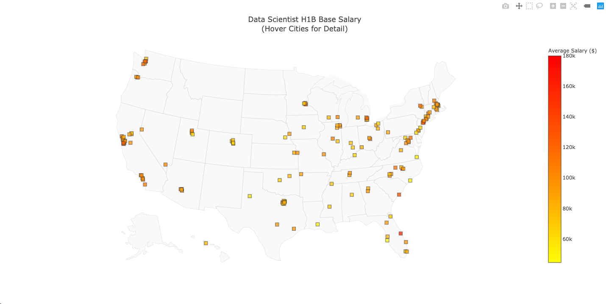

<h1>Data Scientist Salary Across United States</h1>

In this project, I am interested to know the salary across United States. Since it is not possible to obtain the salary of Data Scientist but we can use the salary from H1B Visa application to know how much do employers pay to Data Scientists. 
 
We can obtain the data in the H1B Salary Database provided by Department of Labor. But it does not provide an api or csv files for us to download. If we have the link, we can scrape the html of this page with Beautifulsoup. After we have prepared the data, we can visualize with Plotly.
  
Note that the data is just approximatation.

## Data Acquisition

1 - Data Scientist salary 
The data scientist salary based on H1B applications can be found in the Department of Labor website: <a href="https://h1bdata.info/index.php?em=&job=Data+Scientist&city=&year=All+Years">H1B Database</a> 
This site has an API to request the salary in json file. I have used Beautifulsoup in Getdata.py to extract the data on the html page and export to csv for EDA purpose for the first step. Let's call this salary dataset.
  
2 - Longtitude and Latitude of US cities
If we want to plot on the map through Plotly, we will need the longtitude and latitude but it was not available on salary data set. So we need to obtain those data on the other site:
<a href="https://public.opendatasoft.com/api/records/1.0/search/?dataset=1000-largest-us-cities-by-population-with-geographic-coordinates&rows=1000&sort=-rank&facet=city&facet=state"> OpenDataSoft</a> 
This site has an API to request the top 1000 largest cities in the US for latitude and longtitude in json file. Let's call this location dataset
  
3 - US State in full name and abbreviation 
You may see the columns for states in salary dataset and location dataset not consistent, so I copy the list for state in full name and abbreviation from USPS site (Since there are around 50-60 rows, it was faster to copy and paste in Excel, I shouldn't be lazy).

## Visualization
Once all the data is ready, I joined salary and location dataset. Then, I found the mean of the salary by location. After that, I can plot it with Plotly. 
You may find the visualization below: 
 
 
Alternatively, you may <a hred="https://jacquessham.github.io/ds_salary_opt_viz/">interact with the map</a>.
 
For the plot, I used the code on <a href="https://plot.ly/python/scatter-plots-on-maps/">Plotly<a> 
All the steps I mentioned in this section are done in Viz.py
